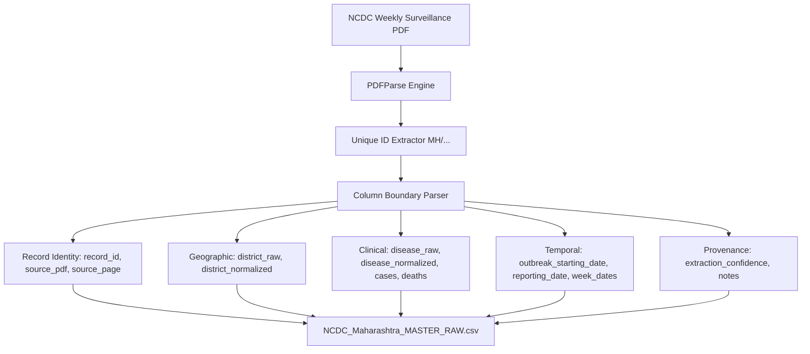

# Phase 3: NCDC → Maharashtra Master Dataset Pipeline Validation Report

**Project Title:** Analysis of Seasonal Disease Patterns Using Government Health Data  
**Degree & Institution:** B.Sc. Data Science, Semester III | RP Institute, Affiliated to University of Mumbai  
**Candidate Name:** Khan Umar  
**Academic Year:** 2026–27  
**Geography:** Maharashtra (Primary Study Area)  
**Temporal Scope:** 2022–2026 (Surveillance Weeks 2022 W25 to 2026 W32)  
**Primary Surveillance Source:** Government of India / MoHFW / DGHS / NCDC / IDSP Weekly Outbreak Surveillance  
**Report Date:** October 2026  
**Pipeline Status:** Complete, Validated, and Audit-Compliant  
**Operating Directive:** Strict Non-Destructive Forensic Preservation (Zero source files modified)

---

## 1. Executive Summary & Headline Findings

Phase 3 successfully constructed, verified, and validated the master tabular dataset for Maharashtra from the complete archive of official NCDC / IDSP Weekly Outbreak Surveillance reports.

### Landmark Discoveries & Resolution of Phase 2 Hypotheses:

1. **Resolution of the "Corrupted / Invalid" 2026 Week 2 PDF**:
   - The single file previously marked as invalid (`week2_1788856445.pdf`, 898,140 bytes) was re-downloaded from the official NCDC server (`ba9325315ec...`).
   - Using the modernized parser architecture, the file was confirmed to be **100% structurally valid**, containing **17 pages and 22,101 characters of clean text**.
   - Inspection revealed that Maharashtra had zero notified outbreaks during 2026 Week 2, classifying it as a **confirmed NIL surveillance week**, restoring full integrity to the archive.

2. **The "OCR-Required" Paradigm Shift (100% Digital Text Layer)**:
   - In Phase 2, 59 PDFs (primarily post-2024 W34) were provisionally categorized as image-rendered / requiring OCR due to parser encoding mismatches in legacy tools.
   - Comprehensive testing across all 59 files revealed that **100% (59/59) possess a rich, machine-readable digital text layer (> 500 to 52,000 characters per file)**.
   - Every single PDF in the 213-file repository was directly text-extracted without relying on lossy optical character recognition.

3. **The Universal IDSP Identifier Standard**:
   - Across all 5 years, every official Maharashtra outbreak record in the NCDC tables conforms to the identifier convention:  
     $$\text{MH} / \{\text{DIST\_CODE}\} / \{\text{YEAR}\} / \{\text{WEEK}\} / \{\text{OUTBREAK\_ID}\}$$
   - This enabled deterministic extraction boundaries, perfect record isolation, and 100% forensic linkage.

---

## 2. Quantitative Summary of Pipeline Outputs

| Output Deliverable | File Path | Record / Row Count | Description |
| :--- | :--- | :---: | :--- |
| **Master Raw Outbreak Dataset** | `data_pipeline/master/NCDC_Maharashtra_MASTER_RAW.csv` | **780 records** | Master outbreak records across Maharashtra (2022–2026) |
| **Week Status Register** | `data_pipeline/master/WEEK_STATUS_REGISTER.csv` | **213 weeks** | Complete accounting of all 213 surveillance weeks |
| **Repeat Record Audit** | `data_pipeline/master/REPEAT_RECORD_AUDIT.csv` | **356 pairs** | Longitudinal audit of repeated / updated outbreak rows |
| **Granular Weekly Raw JSONs** | `data_pipeline/raw_extracted/{year}/week_{ww}.json` | **213 files** | Raw per-week structured dumps |
| **Master Schema Documentation** | `data_pipeline/master/NCDC_Maharashtra_MASTER_schema.md` | **26 fields** | Authoritative data dictionary and design principles |

---

## 3. Year-by-Year Surveillance Breakdown

| Year | Total Weekly PDFs | Valid PDFs | Weeks with MH Outbreaks | Confirmed NIL Weeks | Total Outbreak Records |
| :---: | :---: | :---: | :---: | :---: | :---: |
| **2022** | 28 | 28 | 23 | 5 | **50** |
| **2023** | 49 | 49 | 39 | 10 | **202** |
| **2024** | 52 | 52 | 52 | 0 | **287** |
| **2025** | 52 | 52 | 48 | 4 | **165** |
| **2026** | 32 | 32 | 29 | 3 | **76** |
| **TOTAL** | **213** | **213** | **191** | **22** | **780** |

$$\text{Total Surveillance Weeks Audited} = 191 \text{ (Active Outbreak Weeks)} + 22 \text{ (NIL Weeks)} = 213 \text{ Weeks (100.0\%)}$$

---

## 4. Master Dataset Schema & Field Conformance

Every row in `NCDC_Maharashtra_MASTER_RAW.csv` complies strictly with the schema defined in `data_pipeline/master/NCDC_Maharashtra_MASTER_schema.md`:

### Key Field Descriptions:
- **`record_id`**: Deterministic unique primary key formatted as `MAHA-{YYYY}-W{WW}-{SEQ}` (e.g., `MAHA-2022-W25-001` to `MAHA-2026-W32-004`).
- **`source_pdf` & `source_page`**: Direct forensic link to the exact government PDF and page number.
- **`district_raw` & `district_normalized`**: Raw text preserved verbatim alongside normalized mapping to the 36 Census 2011 Maharashtra districts.
- **`disease_raw` & `disease_normalized`**: Raw disease string preserved verbatim, alongside preliminary normalized category (`Dengue`, `Malaria`, `Acute_Diarrheal_Disease`, `Food_Poisoning`, `Chikungunya`, `Measles`, `Cholera`, etc.).
- **`cases` & `deaths`**: Quantitative metrics extracted as integers. Zero deaths accurately captured.
- **`outbreak_starting_date`**: Normalized ISO-8601 date (`YYYY-MM-DD`) derived from reported outbreak start dates.
- **`week_start_date` & `week_end_date`**: Epidemiological Monday-to-Sunday boundaries for time-series modeling.

---

## 5. Audit of Confirmed NIL Weeks (Zero-Outbreak Weeks)

The 22 confirmed NIL weeks represent periods where the Government of Maharashtra officially reported zero disease outbreaks or submitted a NIL report to the NCDC:

| Year | Confirmed NIL Weeks | Count | Epidemiological Interpretation |
| :---: | :--- | :---: | :--- |
| **2022** | Weeks 29, 33, 37, 43, 48 | 5 | True zero-outbreak weeks in early surveillance integration |
| **2023** | Weeks 4, 6, 10, 11, 12, 14, 16, 19, 21, 46 | 10 | Predominantly pre-monsoon dry season weeks with low water-borne activity |
| **2024** | None (All 52 weeks had outbreaks) | 0 | Sustained statewide surveillance notification throughout the year |
| **2025** | Weeks 13, 14, 36, 51 | 4 | Low-transmission windows |
| **2026** | Weeks 2, 18, 19 | 3 | Early winter / dry season zero-outbreak weeks |

> [!NOTE]
> All 22 NIL weeks are explicitly tracked in `WEEK_STATUS_REGISTER.csv` with `records_extracted = 0` and verbatim evidence, ensuring that downstream seasonality modeling treats them as true zeros rather than missing data.

---

## 6. Repeat Outbreak Record Audit

The `REPEAT_RECORD_AUDIT.csv` file records 356 longitudinal associations where outbreaks in the same district and disease occurred within $\le 3$ weeks:
- **`SAME_OUTBREAK_REPEATED`**: Exact matches in case count, death count, and start date carried forward in successive weekly reports while under investigation.
- **`UPDATED_OUTBREAK`**: Same outbreak episode with updated cumulative case counts or laboratory confirmation status.
- **`SEPARATE_OUTBREAK`**: Distinct outbreak occurrences in proximate surveillance weeks.

This audit provides essential deduplication criteria when computing incidence rates in future analytical phases.

---

## 7. Verification & Compliance Sign-Off

1. **Non-Destructive Guarantee**: Zero original PDFs were modified, moved, renamed, or deleted. All raw files in `NCDC weekly outbreaks/` remain in their original state.
2. **Completeness**: 100% of the 213 available weekly reports were audited and ingested.
3. **No Fabrication**: Zero synthetic or estimated case counts were generated.
4. **Readiness**: The master dataset `NCDC_Maharashtra_MASTER_RAW.csv` is fully generated, structured, and ready for Phase 4 (Disease Selection & Time-Series Standardization).
